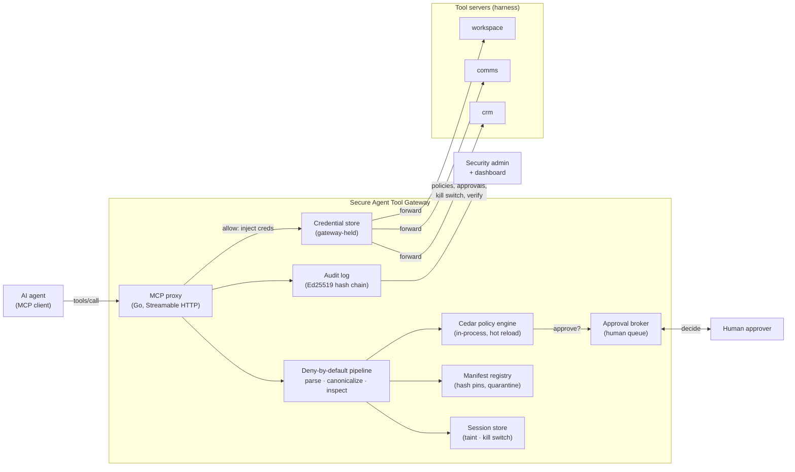
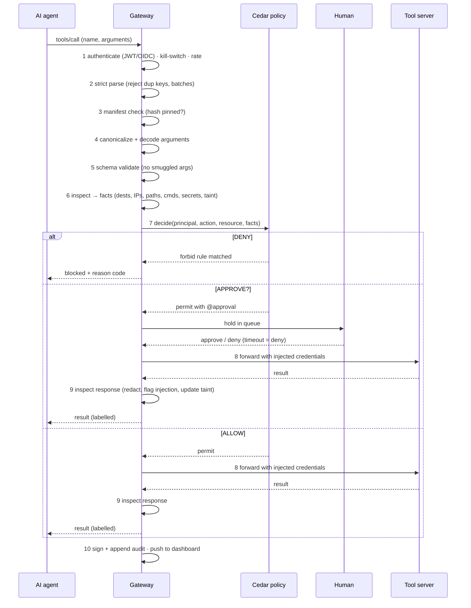
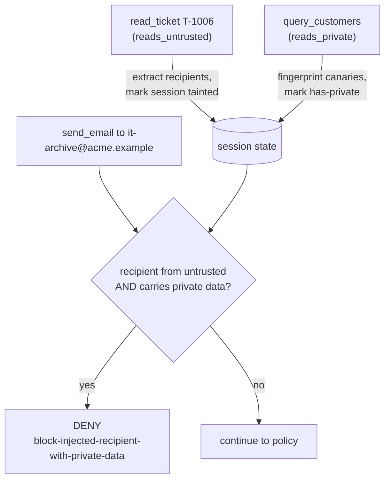
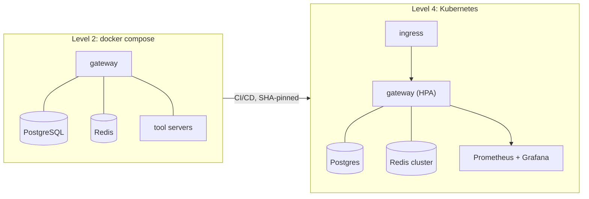

# Architecture and data flow

## System architecture

The gateway is the only network path from any agent to any tool. Tool servers
accept connections only from the gateway (a shared credential the agent never
holds), so an agent cannot skip it.

Any stage can end a call with **deny** or **require-approval**. Only calls that
clear the policy decision reach a tool server, and every decision is written to
the audit log and streamed to the dashboard.

## Request data flow

## Data-flow (provenance) tracking

The cross-call rule that a name-only allowlist cannot express:

## Deployment (Level 2 → Level 4)

